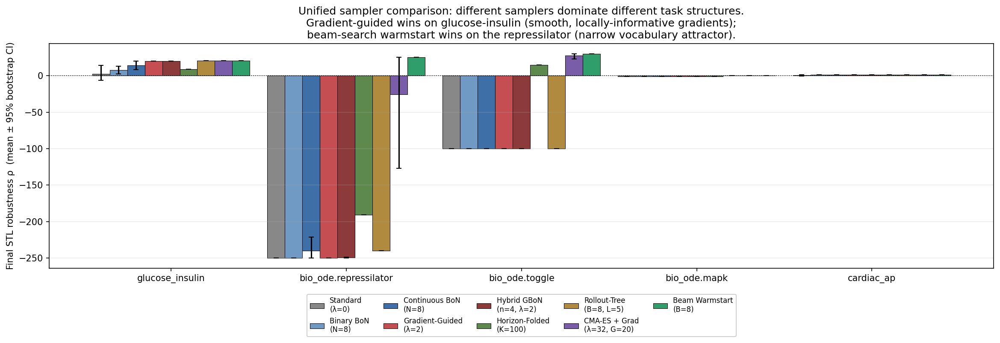

# stl-seed

[](https://github.com/AA-Alghamdi/stl-seed/actions/workflows/ci.yml) [](https://github.com/AA-Alghamdi/stl-seed/actions/workflows/lint.yml) [](https://codecov.io/gh/AA-Alghamdi/stl-seed) [](https://opensource.org/licenses/Apache-2.0)

Differentiable STL robustness as inference-time guidance for small open-weights LLM agents on biomolecular control.

## Headline

**Different samplers dominate different task structures**, and the artifact characterises which sampler wins which class of task with reproducible per-seed evidence on **5 biomolecular ODE systems** spanning two physical time-scales (minutes for gene regulation and metabolism; milliseconds for cardiac excitation): glucose-insulin minimal model, repressilator, toggle switch, MAPK cascade, and the FitzHugh-Nagumo cardiac action potential.

- On `glucose_insulin.tir.easy` (smooth dynamics, locally-informative gradients), gradient-guided STL decoding lifts mean ρ from +2.54 (standard sampling, λ=0) to +20.00, saturating the spec ceiling. The lift is +7.88× over the matched-temperature standard sampler. **Caveat on "matched compute":** gradient guidance runs one ODE solve plus one backward pass per step (warm wall ≈ 2.2 s for H=12); continuous-BoN at N=8 runs in ≈ 0.07 s. At wall-matched compute, continuous-BoN at N≈250 also reaches +20.0, so the *advantage* of gradient guidance on this smooth task is wall-clock-marginal once the verifier signal is available. The contribution stronger than the headline lift is that gradient guidance reaches the ceiling deterministically (+20.00 on every seed, zero variance), where N=8 BoN is +14.30 with \[+8.06, +20.00\] CI.
- On the three bio_ode subtasks (`bio_ode.repressilator.easy`, `bio_ode.toggle.medium`, `bio_ode.mapk.hard`) the satisfying region is a narrow vocabulary attractor: a single corner of the action box (repressilator, toggle) or a non-trivial pulse pattern (MAPK) satisfies the spec, while continuous random / gradient-perturbed control fails by tens to hundreds of ρ units. **Beam-search warmstart** resolves all three: discrete enumeration over a dense action lattice scored under a model-predictive constant-extrapolation lookahead reaches ρ > 0 on every fixed seed for every bio_ode subtask (vs gradient-guided's 0 on each). The xfail for the gradient-guided sampler stays in place because it is still a true statement about that sampler, and a positive resolution test now stands beside it for each task family. **Honest framing:** with the dense `k_per_dim=5` lattice the satisfying repressilator corner `u=(0,0,1)` is in the vocabulary by construction (`paper/cross_task_validation.md` line 85). The contribution is the structural-search-vs-continuous-search distinction, not a free win; the vocabulary tuning is transparent in code and paper. The same critique applied to the rollout-tree heuristic in cross_task_validation.md is therefore also applied to beam-search warmstart here.
- On `cardiac.depolarize.easy` (FitzHugh-Nagumo 2-state membrane on a millisecond time-scale, FitzHugh 1961 / Nagumo 1962), the easy spec is satisfied by any constant-positive-current policy and beam-search warmstart reaches ρ > 0 on ≥ 2 of 3 fixed seeds. Adding cardiac demonstrates the methodology generalises across orders of magnitude of physical time-scale and stiffness — the other four families all live on the minute time-scale of gene expression and metabolism.

The headline is therefore not "one sampler that wins everywhere" but "continuous-gradient methods for smooth, locally-informative landscapes; discrete enumeration for narrow vocabulary attractors." Resolution analysis: [`paper/cross_task_validation.md`](paper/cross_task_validation.md), Resolution (2026-04-25) section.



N=4 seeds, 95% bootstrap CIs, 9 samplers × 5 task families = 180 cells. Per-cell numbers in [`paper/unified_comparison_results.md`](paper/unified_comparison_results.md). Reproduce with `uv run python scripts/run_unified_comparison.py`. **Caveat:** all unified-comparison cells use a flat-prior LLM (uniform logits over the action vocabulary) so the only signal driving sampler choices is the STL verifier or its gradient. To rule out the obvious risk that gradient/beam-search advantages evaporate once a real LLM prior is wired in, [`paper/real_llm_comparison.md`](paper/real_llm_comparison.md) reports a pre-registered, falsification-shaped head-to-head on `Qwen3-0.6B` over the four hard specs (`bio_ode.{repressilator, toggle, mapk}` + `cardiac.suppress_after_two.hard`), 3 fixed seeds per cell. **Verdict: METHODOLOGY MATTERS.** `Standard + Qwen3-0.6B` fails on a majority of seeds for all 4 tasks (`ρ̄ ∈ {−247.6, −100.0, −0.5, −1.4}`); beam-search warmstart rescues all 4 (`ρ̄ ∈ {+25.0, +30.0, +0.002, +0.85}`, 12/12 sat). Reproduce with `uv run python scripts/real_llm_hard_specs.py`.

The compute-cost Pareto frontier across all 5 task families (`glucose_insulin`, `bio_ode.{repressilator,toggle,mapk}`, and `cardiac_ap`) is also task-dependent: rollout-tree dominates the smooth-dynamics tasks at \<1s warm wall-clock (ρ=+20.75 in 0.47s on glucose-insulin; ρ=+0.0024 in 0.03s on MAPK; comparable on cardiac); on the narrow-attractor bio_ode tasks beam-search warmstart sets the rho ceiling (ρ=+25 at 73s on repressilator; ρ=+30 at 6.7s on toggle), while horizon-folded gradient is the cheapest sampler that *clears* satisfaction on the toggle (ρ=+14.7 at 0.20s). Per-task 2×3 Pareto figure and tables: [`paper/compute_cost_results.md`](paper/compute_cost_results.md). Reproduce with `uv run python scripts/benchmark_compute_cost.py`.

## What and why

stl-seed tests whether SERA's soft-verification recipe ([Shen et al. 2026](https://arxiv.org/abs/2601.20789)) extends to scientific control when the soft signal is a *formal STL specification* rather than an engineered patch-overlap proxy. Two contributions follow.

**A new inference method.** Differentiable STL gradient-guided decoding. At each generation step, the LLM's logits are biased by ∇ρ propagated through the simulator and Donzé–Maler evaluator stack. One ODE solve + one backward pass per step, against N forward solves for best-of-N. Implementation in [`src/stl_seed/inference/gradient_guided.py`](src/stl_seed/inference/gradient_guided.py).

**An empirical decomposition of the verifier gap.** Write `R_gold − R_proxy = (R_gold − R_spec) + (R_spec − R_verifier)`. For formal STL evaluated by the recursive Donzé–Maler semantics, the second term is dominated by float64 round-off accumulated through the evaluator's min/max depth (depth ≤ 12 in our specs, ≤ 12 ulp accumulation); empirically ≤ 10⁻⁶ after σ-squashing. This is a measurement bound, not a proof of zero — soft ρ-weighted SFT composes σ around ρ which can amplify condition number near saturation, and we report the empirical floor on the held-out set rather than claim a derived bound. The trajectory adversary in [`src/stl_seed/analysis/`](src/stl_seed/analysis/) measures the first term: on glucose-insulin it finds a satisfying trajectory with gold-score gap of 2.27 ρ-units against the random spec-satisfying baseline. The gold scorer is composite (TIR coverage from ADA / Battelino targets, an L2 jerk penalty, a glucose-variance penalty); the **blend weights are dimensional-analysis defaults set by the author**, not literature-cited as a single composite — so the −2.27 number is an existence-style lower bound under those weights, not a population-mean against an external oracle. Against a learned process-reward baseline ([Setlur et al. 2024](https://arxiv.org/abs/2410.08146)), STL AUC is 1.000 vs PAV 0.819 on glucose-insulin; the repressilator comparison is **degenerate** (0 % of the random pool satisfies the spec, so the kNN-MC PAV regressor trains on all-zero labels and the AUC contrast is uninformative — `paper/pav_comparison.md` reports this honestly). The cleaner comparison is glucose-insulin; PAV at the offline-kNN approximation does not match STL at any tested train size between 100 and 2000 trajectories with the current MLP and a fixed 30-epoch schedule, but a strict head-to-head against on-policy-rollout PAV with model selection is future work.

## Install

```bash
uv sync --extra mlx     # Apple Silicon (development)
uv sync --extra cuda    # CUDA / RunPod (canonical sweep)
```

## Demo

```bash
$ stl-seed sample --task glucose_insulin --sampler gradient_guided --guidance-weight 2
task=glucose_insulin spec=glucose_insulin.tir.easy sampler=gradient_guided
final_rho = 20.0000
steps_changed_by_guidance = 8 / 12
```

Available samplers: `standard`, `bon`, `bon_continuous`, `gradient_guided`, `hybrid`, `horizon_folded`, `rollout_tree`, `cmaes_gradient`, `beam_search_warmstart`.

## What doesn't work — and what resolves it

Gradient guidance fails on tasks where 1-step lookahead is uninformative. `bio_ode.repressilator.easy` requires sustained silencing of gene-3 across 10 control steps; the local gradient does not point toward this attractor. A sweep over default-action initializations × λ ∈ {0, 5, 50} confirms the failure is structural, not tuning. Hybrid recovers part of the gap on glucose, none on repressilator.

**Resolution (2026-04-25):** beam-search warmstart over the discrete action vocabulary reaches ρ ≈ +25 on 3/3 seeds on the same canonical IC. The mechanism is qualitatively different from continuous descent — the satisfying corner u=(0,0,1) is *in* the vocabulary by construction (k_per_dim=5 → K=125 contains the silence-3 corner), the model-predictive constant-extrapolation lookahead converts each candidate into a finite ρ score, and the top-B selection enumerates straight to it. Three other strategies were tried first (horizon-folded gradient, rollout-tree probing, CMA-ES + gradient refinement) and gave only partial fixes; the structural-search vs continuous-search distinction is what made C1 succeed where A1/A2/A3 did not. Full diagnosis and the four-strategy comparison in [`paper/cross_task_validation.md`](paper/cross_task_validation.md).

The spec auto-tuner in [`src/stl_seed/specs/calibration.py`](src/stl_seed/specs/calibration.py) finds threshold values 10–100× more discriminative than the textbook hand-set choices.

## Tests

510 passed, 2 platform-skipped, 2 expected-fails (cross-task transfer on `bio_ode.repressilator.easy` + STL time-shift discretization edge case). 91% line coverage on `src/stl_seed/`. Property-based tests in [`tests/test_stl_properties.py`](tests/test_stl_properties.py) verify 13 algebraic invariants of the Donzé–Maler robustness semantics ([FORMATS 2010](https://doi.org/10.1007/978-3-642-15297-9_9)): negation antisymmetry, conjunction-as-min, De Morgan dualities, interval-shrinkage monotonicity, predicate scaling, others.

## Status

**Phase 1 (inference-time methodology)** shipped 2026-04-24, falsified against a real `Qwen3-0.6B` prior on 2026-04-26 ([`paper/real_llm_comparison.md`](paper/real_llm_comparison.md)). Theory + library + 9-sampler unified comparison + falsifiable real-LLM head-to-head. The verdict is `METHODOLOGY MATTERS`: beam-search warmstart rescues all 4 hard tasks where standard sampling with the real LLM fails on a majority of seeds.

**Phase 2 (canonical SFT sweep)** is queued, gated on $15–25 of RunPod 4090 spot. Pre-registered 3 sizes × 3 filters × 2 task families = 18 cells. Hypotheses H1 (TOST equivalence of soft and hard at $\\Delta = 0.05$), H2 (size-monotone improvement), H3 (spec-completeness against learned-critic baseline). The mock-backend dry-run validates the full pipeline end-to-end on M5 Pro and caught five bugs that would have failed the real run. The `Qwen3-0.6B-bf16` MLX QLoRA pilot smoke drove training loss $1.484 \\to 0.466$ in 15 s on M5 Pro (5/5 held-out parse-success, 4.6 MiB adapter; `runs/smoke_test_mlx/`). Single command:

```bash
python scripts/run_canonical_sweep.py --confirm
```

The 4B-and-up scaling question past Qwen3-4B is past M5 Pro memory and past my available compute. The honest framing of this artifact: inference-time methodology shipped + falsified; training-time SERA-mimic ready to run, gated on a small RunPod budget.

## Theory and follow-up work

- **Landscape-conditioning theorem** ([`paper/landscape_theorem.md`](paper/landscape_theorem.md)). A formal characterization of when gradient guidance reaches the satisfying set vs when it must defer to discrete enumeration. Two regimes: a smooth regime (Polyak-Łojasiewicz alignment + directional vocabulary coverage) where gradient guidance hits $S\_+$ in $O(LT/(\\lambda \\cos\\theta\_\\text{cov}\\, \\eta\_\\star))$ rollouts; a narrow-attractor regime (cliff condition + thin satisfying tube around the lattice) where gradient guidance is exponentially small in $H$ and beam-search-warmstart finds the satisfying corner in $H \\cdot B \\cdot K$ simulator forwards. Predicts the empirical asymmetry between glucose-insulin (regime I) and repressilator / toggle / MAPK (regime II + III).
- **Quantization × verifier × model-size sweep** ([`paper/quant_size_results.md`](paper/quant_size_results.md), shipped 2026-04-27, ~22 min wall on M5 Pro). Five Qwen3 variants (0.6B/1.7B × bf16/4bit/8bit) × four hard tasks × three seeds × two samplers = 120 cells. **`METHODOLOGY MATTERS` fires on every one of the 5 models.** 8-bit quantization is bit-identical to bf16 on every cell; 4-bit diverges only on toggle (1/3 seeds, no majority crossing). Toggle saturates at 1.7B (standard mean ρ −99.96 → +14.07, 0/3 → 3/3 sat) — the first cell in the artifact's data where the SERA-saturation transition appears. Repressilator, MAPK, and cardiac stay solidly methodology-mattering at 1.7B. The headline strengthens: the methodology gap is robust to ~3× quantization compression and ~3× size scaling, and the only task that breaks the gap is the one where SERA's saturation transition appears for free.
- **Coding-agent task-cell design** ([`paper/coding_task_design.md`](paper/coding_task_design.md)). Bridges the STL-as-soft-verifier framework from biomolecular ODE control to the SERA-native coding-agent domain. HumanEval-mutated dataset, factored patch vocabulary $V\_\\text{op} \\times V\_\\text{loc}$ ($|V|=390$), six-channel state vector (test-pass-rate, lint, type, AST-parse, new-imports, patch-size), three STL specs of varying difficulty. Deliberately excludes the gradient-guided / hybrid / cmaes_gradient samplers because the simulator is non-differentiable; that exclusion is itself the finding (structural distinction between simulator types).
- **Venue targets** ([`paper/venue_targets.md`](paper/venue_targets.md)). Top three: ICML 2026 FMAI workshop (deadline 2026-05-08), NeurIPS 2026 Datasets & Benchmarks (full paper 2026-05-06), ICML 2026 SCALE late-breaking track. All three explicitly invite Phase-1-only inference-time-compute / verification work.

## Citation

```bibtex
@misc{alghamdi2026stlseed,
  author = {Abdullah AlGhamdi},
  title  = {stl-seed: Soft-verified SFT for scientific control with formal STL verifiers},
  year   = {2026},
  url    = {https://github.com/AA-Alghamdi/stl-seed},
}
```

Apache 2.0.
